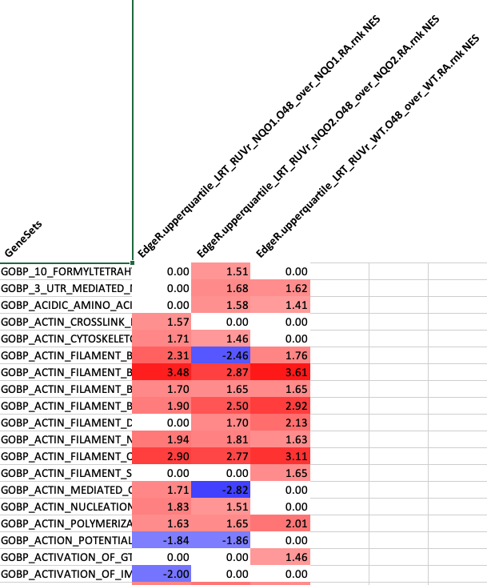
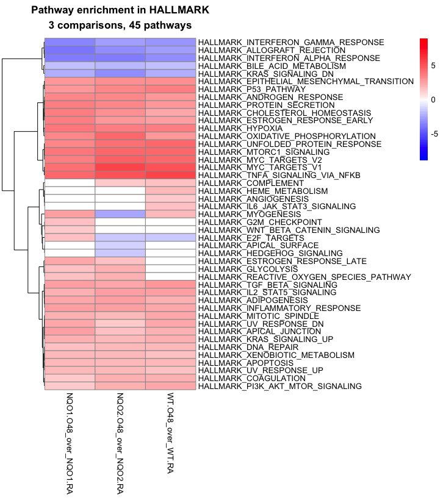

# derecksLabTools

Dereck’s lab tools package - installable via devtools.

## Index

1.  `RNAseq_GSEAheatmaps`: Make heatmaps from combined GSEA reports
    after EdgeR
2.  `Volcano-class`: \\code{S4 class; Volcano data.table manipulated and
    prepared for plotting
3.  `cite_RNAseqGSEA`: RNAseq GSEA methods citation
4.  `dtcolnames`: Get the data column names from data.table; exclude ID
    col
5.  `excel2List`: Read an excel workbook to a named list of data.tables
    or other type
6.  `list2Excel`: Save a named list of \\code{data.frames \|
    \\code{data.tables to and Excel workbook with multiple sheets
7.  `plot,Volcano,ANY-method`: \\code{S4 method for \\code{Volcano
    \\code{S4 class
8.  `read.gmt`: Read a .gmt pathway type file as a list.
9.  `sig2UpDownGmt`: Signature(s) files to GMT list; split up and down
    (inclusive) based on log2fc
10. `summariseSignatures`: Summarise how many genes up and down from a
    combined signature file
11. `table2tabs`: Parse Excel tables from one sheet to named tabs
12. `tabs2table`: Combine Excel sheets to single table
13. `to.data.frame`: \\code{S3 generic; convert to data.frame
    \\strong{move column to \\code{rownames
14. `to.matrix`: \\code{S3 generic; convert to matrix \\strong{move
    column to \\code{rownames
15. `valueCoordinates`: Coordinates of X values in a
    data.table\|data.frame
16. `write.gmt`: Write GMT list to a formatted file.

## Install

Use `devtools` to install this package:

``` r
devtools::install_github("CoarfaBCM/derecksLabTools", force = TRUE)
library("derecksLabTools")
```

## Tutorials

Load the library with `library("derecksLabTools")` or call every
function preceded with: `derecksLabTools::`.

### `valueCoordinates()`

Sometimes knowing NAs or X value are present in your data is not enough,
you want to know where exactly.

This function does: `data == value | is.na(data)`

To create a truth table and then retrieves the column and row of where
the value occurred as a data.frame.

``` r
test <- head(iris, 10)
test[3:5, 1:2] <- NA
derecksLabTools::valueCoordinates(test, value = NA)
```

      column row
    1      1   3
    2      2   4
    3      1   5
    4      2   3
    5      1   4
    6      2   5

### `excel2List()`

Returns a list of desired type of a `data.frame` default is
`data.table`. You can pass a coercion function either as a string or raw
function, see usage:

``` r
derecksLabTools::excel2List(
    system.file("extdata", "comparisons.xlsx", package = "derecksLabTools"),
    FUN_type = as.data.frame
)

derecksLabTools::excel2List(
    system.file("extdata", "comparisons.xlsx", package = "derecksLabTools"),
    FUN_type = "data.table::as.data.table"
)
```

### `RNAseq_GSEAheatmaps()`

Takes in a compiled GSEA report and creates heatmaps.

Input data format as follows:



Here is an example of the output:



Usage:

``` r
path <- system.file(
    "extdata",
    "GSEA-combined-enrichment-profiles.xlsx",
    package = "derecksLabTools"
)

heatmaps <- derecksLabTools::RNAseq_GSEAheatmaps(
    path,
    scale_bounds = NULL,
    reo_order_cols = NULL,
    clust_row = TRUE,
    clust_col = FALSE,
    show_rownames = TRUE,
    show_colnames = TRUE
)

pdf("./outputs/20211220_GSEA_results/gsea_results_bp/gobp-enrichment-heatmap.pdf", width = 7, height = 10)
print(heatmaps$gobp)
dev.off()

pdf("./outputs/20211220_GSEA_results/gsea_results_hallmark/hallmark-enrichment-heatmap.pdf", width = 7, height = 10)
print(heatmaps$hallmark)
dev.off()

pdf("./outputs/20211220_GSEA_results/gsea_results_kegg/kegg-enrichment-heatmap.pdf", width = 7, height = 10)
print(heatmaps$kegg)
dev.off()

pdf("./outputs/20211220_GSEA_results/gsea_results_reactome/reactome-enrichment-heatmap.pdf", width = 7, height = 10)
print(heatmaps$reactome)
dev.off()
```

### `table2tabs()`

Parse Excel tables from one sheet to named tabs

Parses tables from one Excel sheet based on an identifier, empty
rows/columns must be left between tables as these are used for edge
detection by the `is.na()` function. Each table on the sheet should have
column”” names, the first is used for identification of tables, the
second for tab names.

This is a tool used at our lab for quickly writing comparisons for the
RNAseq analysis and then converting them to multiple tabs.

The typical format is; colnames: “ID”, “comparison_name”, where ID
designates the sample ID’s and comparison_name designates test/control.

Note that you can have other content on your excel sheet as long as it
does not contain the table_id string used for parsing.

Input:


Output:


Arguments:

-   `file` String; path to a file type xlsx.
-   table_id String
    $$default "ID"$$
    ; this is used for identifying the individual tables on a single
    sheet.
-   `out_file` String; the name of the output file - must have extension
    `.xlsx`.
-   `return` Boolean
    *d**e**f**a**u**l**t**F**A**L**S**E*
    ; if TRUE returns the parsed data.
    -   `Returns`: if return argument set to TRUE; a list of
        `data.frame`s - might be useful for analysis - the primary
        output is the file output.

``` r
derecksLabTools::table2tabs(
    file = "./data/table2tabs/comparisons-setup.xlsx",
    table_id = "ID",
    out_file = "output-file.xlsx",
    return = FALSE
)
```

### `tabs2table()`

Combine all sheets (tabs) from one or more Excel workbooks to a single
table (an index is generated - first tab), padding is added (empty rows
and columns) between the indvidual tables. This is useful for getting an
overview of your data and avoiding having to click n tabs.

Input:


Output:


Arguments:

-   `dir` String; path to a directory; this will read all `.xlsx` files
    at this location.
-   `columns` Integer
    *d**e**f**a**u**l**t*3
    ; defines the number of columns to split the combined tables over.
    This splits the data and thus avoids having to scroll over a large
    amount of tables.
-   `out_file` String; the name of the output file - must have extension
    `.xlsx`.
-   `return` Boolean
    *d**e**f**a**u**l**t**F**A**L**S**E*
    ; if TRUE returns the parsed data.
    -   `Returns` if return arguemnt set to TRUE; a list of
        `data.frame`s - might be useful for analysis - the primary
        output is the file output.

``` r
derecksLabTools::tabs2table(
    dir = "./mycomparisons-are-here/",
    columns = 3,
    out_file = "output-file.xlsx",
    return = FALSE
)
```

### `cite_RNAseqGSEA()`

Prints methods used for RNAseq and GSEA analysis, allows for variable
interpolation to print a custom message.

``` r
cite_RNAseqGSEA(fold_changes = c(1.5, 2.0), normalisation_type = "TMM")
```

``` txt
Methods: RNA seq and GSEA processing

RNAseq data was trimmed using cutadapt[1] v1.18 and fastQC[2] v0.11.9. Mapping was done with Homo_sapiens.GRCh38.101.gtf[3] as a reference genome. Trim and mapping quality was assesed with the multiqc[4] utility version 1.8. Differential expression analysis was done with use of the edgeR[5] package version 3.32.1 and EDAseq[6] 2.24.0. An FDR cutoff of 0.05 was selected and fold change cutoff: c("1.5, ", "2, "); TMM normalisation was used. GSEA[7, 8] (gene set enrichment analysis) was run with GSEA version 3.0. We used msigdb[8, 8] 7.3 human gene set files including: c2.cp.kegg.v7.3.symbols.gmt, c2.cp.reactome.v7.3.symbols.gmt, c5.go.bp.v7.3.symbols.gmt, h.all.v7.3.symbols.gmt as reference pathways. Produced reports were filtered for an FDR cutoff of 0.25, these were then used to create heatmaps.

[1] Martin, Marcel. "Cutadapt Removes Adapter Sequences from High-Throughput Sequencing Reads." EMBnet.journal, vol. 17, no. 1, 2011, p. 10., doi:10.14806/ej.17.1.200.
[2] Andrews, S. (2010). FastQC: A Quality Control Tool for High Throughput Sequence Data [Online] http://www.bioinformatics.babraham.ac.uk/projects/fastqc/
[3] Schneider, Valerie A., et al. "Evaluation of GRCh38 and De Novo Haploid Genome Assemblies Demonstrates the Enduring Quality of the Reference Assembly." Genome Research, vol. 27, no. 5, 2017, pp. 849–864., doi:10.1101/gr.213611.116.
[4] Ewels, Philip, et al. "MultiQC: Summarize Analysis Results for Multiple Tools and Samples in a Single Report." Bioinformatics, vol. 32, no. 19, 2016, pp. 3047–3048., doi:10.1093/bioinformatics/btw354.
[5] Robinson, M. D., et al. "EdgeR: a Bioconductor Package for Differential Expression Analysis of Digital Gene Expression Data." Bioinformatics, vol. 26, no. 1, 2009, pp. 139–140., doi:10.1093/bioinformatics/btp616.
[6] Risso, Davide, et al. "GC-Content Normalization for RNA-Seq Data." BMC Bioinformatics, vol. 12, no. 1, 2011, p. 480., doi:10.1186/1471-2105-12-480.
[7] Subramanian, A., et al. "Gene Set Enrichment Analysis: A Knowledge-Based Approach for Interpreting Genome-Wide Expression Profiles." Proceedings of the National Academy of Sciences, vol. 102, no. 43, 2005, pp. 15545–15550., doi:10.1073/pnas.0506580102.
[8] Liberzon, A., et al. "Molecular Signatures Database (MSigDB) 3.0." Bioinformatics, vol. 27, no. 12, 2011, pp. 1739–1740., doi:10.1093/bioinformatics/btr260.
[9] Liberzon, Arthur, et al. "The Molecular Signatures Database Hallmark Gene Set Collection." Cell Systems, vol. 1, no. 6, 2015, pp. 417–425., doi:10.1016/j.cels.2015.12.004.
```
