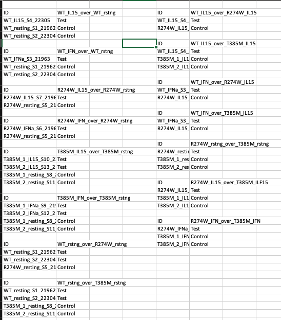
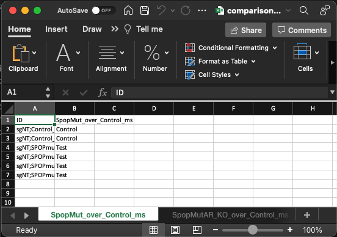

# derecksLabTools

Dereck's lab tools package - installable via devtools.

## Functions

- `tabs2table()`: Combine Excel sheets to single table.
- `table2tabs()`: Parse Excel tables from one sheet to named tabs.

## Tutorial

Load the library with `library("derecksLabTools")` or call every function preceeded with: `derecksLabTools::`.

### `table2tabs()`

Parse Excel tables from one sheet to named tabs

Parses tables from one Excel sheet based on an identifier, empty rows/columns must be left between tables as these are used for edge detection by the `is.na()` function. Each table on the sheet should have column"" names, the first is used for identification of tables, the second for tab names.

This is a tool used at our lab for quickly writing comparisons for the RNAseq analysis and then converting them to multiple tabs.

The typical format is; colnames: "ID", "comparison_name", where ID designates the sample ID's and comparison_name designates test/control.

Note that you can have other content on your excel sheet as long as it does not contain the table_id string used for parsing.

Input:



Output:



Arguments:

- `file` String; path to a file type xlsx.
- table_id String \[default "ID"\]; this is used for identifying the individual tables on a single sheet.
- `out_file` String; the name of the output file - must have extension `.xlsx`.
- `return` Boolean \[default FALSE\]; if TRUE returns the parsed data.
    - `Returns`: if return argument set to TRUE; a list of `data.frame`s - might be useful for analysis - the primary output is the file output.

```r
derecksLabTools::table2tabs(
    file = "./data/table2tabs/comparisons-setup.xlsx",
    table_id = "ID",
    out_file = "output-file.xlsx",
    return = FALSE
)
```

### `tabs2table()`

Combine all sheets (tabs) from one or more Excel workbooks to a single table (an index is generated - first tab), padding is added (empty rows and columns) between the indvidual tables. This is useful for getting an overview of your data and avoiding having to click n tabs.

Input:


Output:


Arguments:

- `dir` String; path to a directory; this will read all `.xlsx` files at this location.
- `columns` Integer \[default 3\]; defines the number of columns to split the combined tables over. This splits the data and thus avoids having to scroll over a large amount of tables.
- `out_file` String; the name of the output file - must have extension `.xlsx`.
- `return` Boolean \[default FALSE\]; if TRUE returns the parsed data.
    - `Returns` if return arguemnt set to TRUE; a list of `data.frame`s - might be useful for analysis - the primary output is the file output.

```r
derecksLabTools::tabs2table(
    dir = "./mycomparisons-are-here/",
    columns = 3,
    out_file = "output-file.xlsx",
    return = FALSE
)
```

## Install

Use `devtools` to install this package:

```r
devtools::install_github("CoarfaBCM/derecksLabTools", force = TRUE)
library("derecksLabTools")
```
